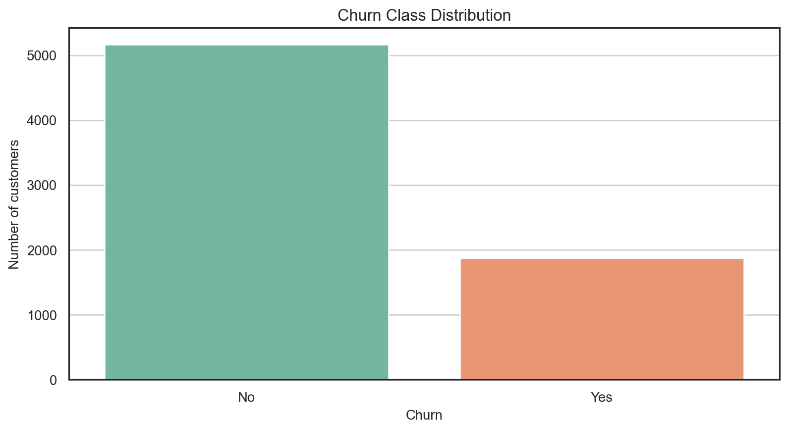
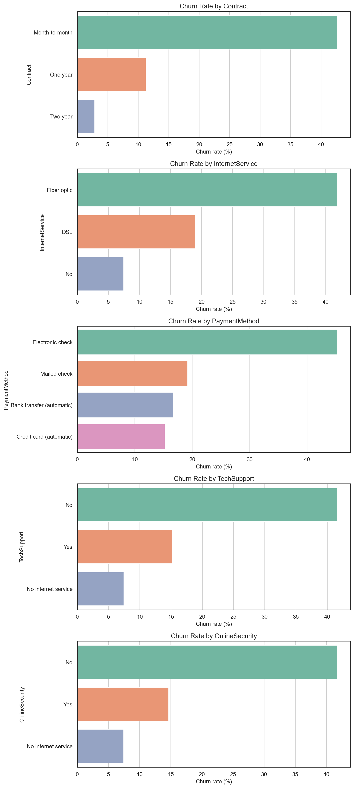
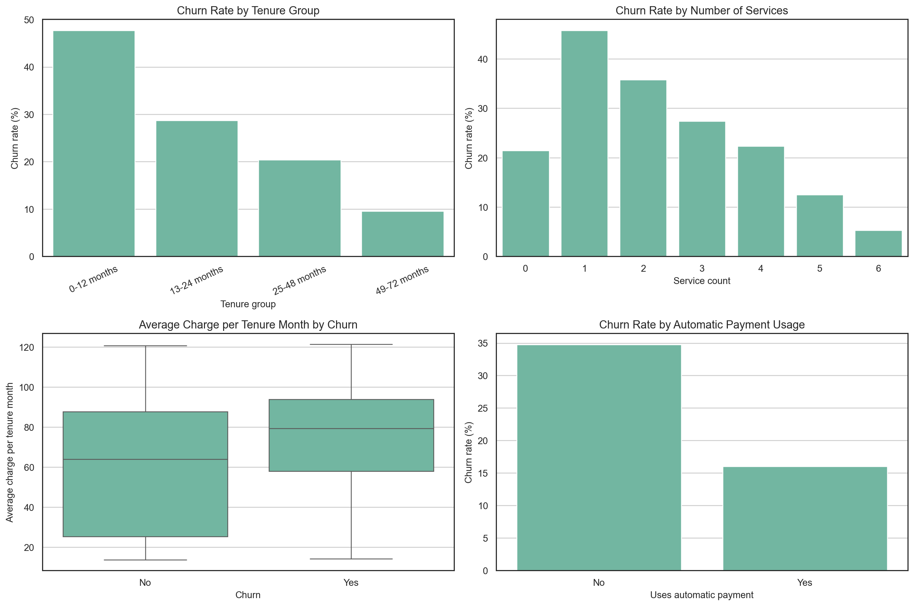
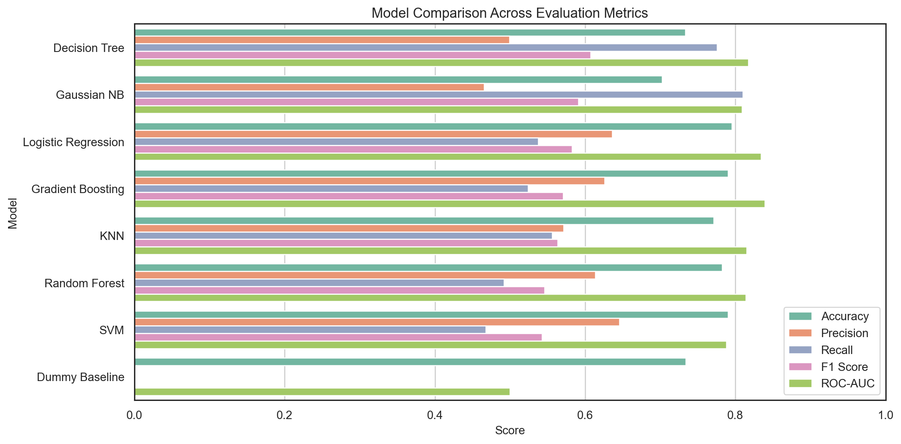
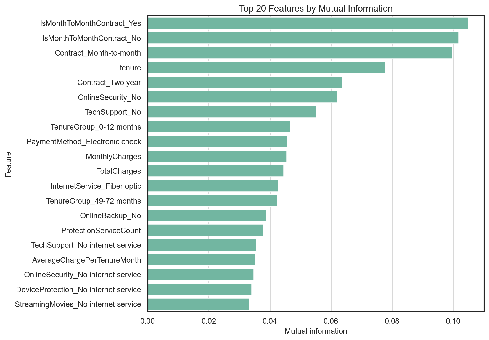
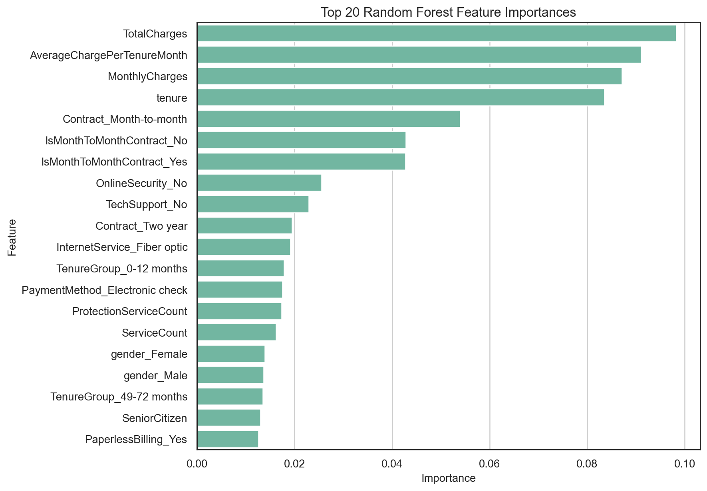
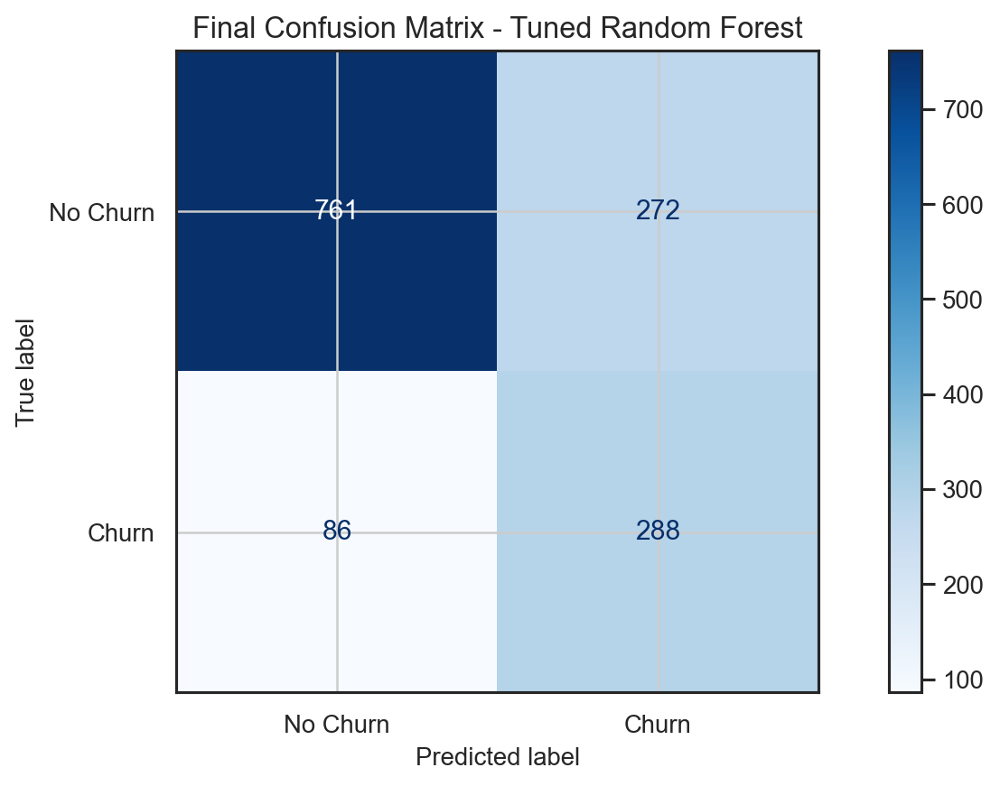
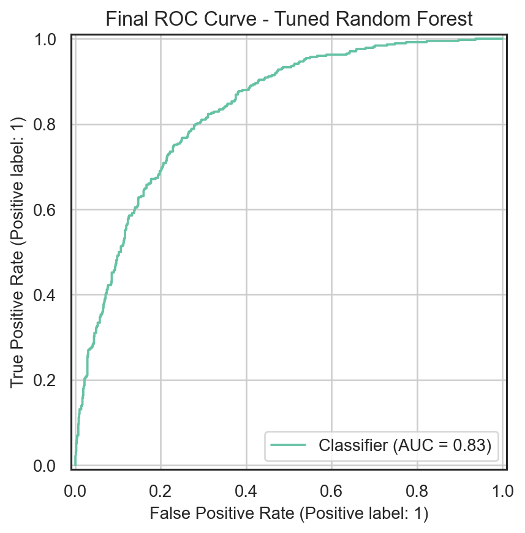

# Abstract

Customer churn is a practical business problem in telecommunications because retaining an existing customer is often less expensive than acquiring a new one. This report presents a supervised machine learning workflow for predicting whether a customer is likely to churn using demographic, service, contract, and billing attributes from a Telco Customer Churn dataset. The project follows a reproducible methodology: data inspection, cleaning, exploratory analysis, feature engineering, model training, model comparison, feature selection, feature importance analysis, and hyperparameter optimization.

The dataset contains 7,043 customer records and 21 original columns. After converting `TotalCharges` from text to numeric format, 11 rows with missing billing totals were removed, leaving 7,032 complete observations. The churn class represents 26.58% of the cleaned dataset, which makes accuracy alone an incomplete measure of model quality. For this reason, the analysis emphasizes precision, recall, F1-score, and ROC-AUC, with special attention to recall and F1-score for the churn class.

Several classification algorithms were evaluated using the same stratified train/test split and pipeline-based preprocessing. The tuned Random Forest achieved the best final F1-score of 0.6167 on the test set, with churn recall of 0.77 and ROC-AUC of 0.8333. These results show that the model can identify a large share of customers who churn, although this comes with moderate precision. In a real retention setting, this trade-off may be acceptable if the business prefers to contact more at-risk customers rather than miss customers who are likely to leave.

# Keywords

Customer churn, telecommunications, binary classification, feature engineering, Random Forest, model evaluation, machine learning

# 1. Introduction

Telecommunication providers operate in a competitive market where customers can move between service providers relatively easily. When customers cancel a subscription or stop using a service, the company loses direct revenue and may also lose future cross-selling opportunities. A churn prediction model can support retention teams by estimating which customers have higher risk before they leave.

The goal of this project is to build and evaluate a machine learning workflow for customer churn prediction. The workflow is designed as an academic seminar project, but the problem is also realistic from a business perspective. The model does not only need to be accurate overall. It should also detect customers from the smaller churn class, because those are the cases that are most important for retention actions.

The project uses the notebook `notebooks/01-telco-churn-prediction.ipynb` as the computational reference. The notebook contains the complete implementation, while this report explains the motivation, methodology, results, and limitations in a structured written form.

# 2. Problem Definition

The task is a binary classification problem. Each row represents one customer, and the target variable is `Churn`, which indicates whether the customer left the company. In the notebook, this target is encoded into a binary label named `ChurnBinary`, where retained customers are represented as 0 and churned customers are represented as 1.

The input features include demographic variables, service subscriptions, contract type, billing method, monthly charges, and total charges. The prediction problem can be stated as follows: **given a customer's available account information, estimate whether the customer belongs to the churn class**.

From a business point of view, the cost of errors is not symmetrical. A false positive means that a retained customer is incorrectly flagged as high risk, which may lead to an unnecessary retention action. A false negative means that a customer who will actually churn is not detected. In many retention scenarios, false negatives are more harmful because the company loses the opportunity to intervene. Therefore, this report discusses recall and F1-score in addition to accuracy.

# 3. Dataset Description

The dataset is a flat customer table with 7,043 original observations and 21 original columns. The columns describe customer identity, demographic status, subscribed services, contract information, payment method, charges, and churn outcome. The identifier column `customerID` is not used as a predictive feature because it does not describe customer behavior.

| Item | Value |
| --- | --- |
| Original observations | 7043 |
| Original columns | 21 |
| Blank `TotalCharges` values | 11 |
| Cleaned observations | 7032 |
| Rows removed | 11 |
| Churned customers | 1869 |
| Churn rate | 26.58% |

The target distribution is moderately imbalanced. Most customers in the cleaned dataset did not churn, while approximately one quarter did. This imbalance is important because a naive model can achieve a superficially high accuracy by predicting the majority class too often. For example, always predicting "No Churn" would ignore the practical objective of identifying customers who are likely to leave.

*Figure 1. Distribution of retained and churned customers in the cleaned dataset.*

# 4. Data Cleaning and Preprocessing

The first data quality issue is the `TotalCharges` column. Although this column represents a numeric billing amount, it is stored as text because 11 records contain blank strings. These blanks become missing values after numeric conversion. Because they represent only 0.16% of the original dataset, the affected rows were removed instead of imputed.

This decision keeps the cleaning process simple and avoids inventing artificial billing values for a very small subset of records. After cleaning, the dataset contains 7,032 observations. The `Churn` column is mapped into `ChurnBinary`, and the original text target is excluded from the model input.

Preprocessing is implemented through scikit-learn pipelines. Numerical variables are standardized with `StandardScaler`, and categorical variables are transformed with one-hot encoding. This is important because transformations are fitted only on the training split during model training and cross-validation. The pipeline structure reduces the risk of data leakage and makes model comparison more consistent.

# 5. Exploratory Data Analysis

Exploratory analysis is used to understand which customer attributes are likely related to churn. The notebook compares churn rates across contract type, internet service, payment method, technical support, online security, tenure, and charges.

The exploratory results show that contract type is one of the strongest visible churn indicators. Customers with month-to-month contracts have higher churn rates than customers with one-year or two-year contracts. This pattern is intuitive because short-term contracts make switching easier and may indicate weaker commitment to the provider.

Service and support variables are also informative. Customers without online security or technical support show higher churn rates than customers who have these services. Payment method is another useful signal: electronic check users have a higher churn rate than customers using automatic payment methods. These patterns suggest that churn is connected not only to price, but also to service relationship depth and convenience.

*Figure 2. Churn rate by contract, internet service, payment method, technical support, and online security.*

# 6. Feature Engineering

The original features already contain useful information, but additional variables were created to summarize customer behavior in more compact forms. The engineered variables include:

- `ServiceCount`, the number of selected add-on services used by the customer.
- `ProtectionServiceCount`, the number of protection-related services.
- `HasOnlineProtection`, a binary summary of whether the customer uses at least one protection service.
- `HasStreamingService`, a binary summary of streaming service usage.
- `UsesAutomaticPayment`, based on whether the payment method is automatic.
- `IsMonthToMonthContract`, based on contract type.
- `AverageChargePerTenureMonth`, calculated from total charges and tenure.
- `TenureGroup`, which groups tenure into interpretable bands.
- `MonthlyChargeGroup`, which groups monthly charges into billing bands.

These features are intended to capture domain-level patterns that may be harder for some models to learn directly from many separate categorical variables. For example, a count of support and protection services gives a compact measure of service adoption. A month-to-month contract indicator directly captures a pattern observed during exploratory analysis.

*Figure 3. Churn patterns for tenure groups, service count, average charge per tenure month, and automatic payment usage.*

# 7. Modeling Methodology

The data is split into training and test sets using an 80/20 stratified split with a fixed random state. Stratification preserves the churn ratio in both subsets. The training set contains 5,625 customers, and the test set contains 1,407 customers.

The initial baseline model is Logistic Regression trained on the cleaned original features. Logistic Regression is a suitable baseline because it is fast, interpretable, and commonly used for binary classification with encoded categorical predictors.

After the baseline, the engineered feature set is used to compare multiple algorithms:

- Dummy classifier with the majority-class strategy.
- Logistic Regression.
- Decision Tree with balanced class weights.
- Random Forest with balanced class weights.
- Gradient Boosting.
- K-Nearest Neighbors.
- Support Vector Machine.
- Gaussian Naive Bayes.

Each model is evaluated using the same split and the same preprocessing logic. Five-fold cross-validation is used on the training data to estimate stability, and the fitted models are then evaluated on the held-out test set.

# 8. Evaluation Metrics

The main metrics are accuracy, precision, recall, F1-score, and ROC-AUC. Accuracy measures the share of correct predictions, but it can be misleading when the classes are imbalanced. Precision measures how many predicted churn cases are truly churn cases. Recall measures how many actual churn cases are detected by the model. F1-score balances precision and recall. ROC-AUC measures the model's ability to rank churned customers above retained customers across thresholds.

For this project, F1-score is used as the main selection criterion because it balances the need to identify churned customers with the need to avoid too many false alarms. Recall is also important because a retention-focused system should avoid missing too many customers who are likely to leave.

# 9. Results

The original Logistic Regression baseline produced an accuracy of 0.8045, churn precision of 0.6495, churn recall of 0.5749, F1-score of 0.6099, and ROC-AUC of 0.8359. This is a strong interpretable starting point. The engineered-feature Logistic Regression model had similar ROC-AUC but lower F1-score on the test split, which suggests that the added variables did not improve this specific linear model.

| Model | Accuracy | Precision | Recall | F1 Score | ROC-AUC |
| --- | --- | --- | --- | --- | --- |
| Logistic Regression - Original Features | 0.8045 | 0.6495 | 0.5749 | 0.6099 | 0.8359 |
| Logistic Regression - Engineered Features | 0.7953 | 0.6361 | 0.5374 | 0.5826 | 0.8342 |

When multiple model families were compared on the engineered feature set, the Decision Tree achieved the highest initial test F1-score of 0.6073. Gaussian Naive Bayes achieved high recall of 0.8102 but lower precision, meaning it detected many churned customers but also produced more false positives. Logistic Regression and Gradient Boosting achieved stronger accuracy and ROC-AUC, but lower churn recall than the Decision Tree.

| Model | Accuracy | Precision | Recall | F1 Score | ROC-AUC |
| --- | --- | --- | --- | --- | --- |
| Decision Tree | 0.7335 | 0.4991 | 0.7754 | 0.6073 | 0.8173 |
| Gaussian NB | 0.7022 | 0.4654 | 0.8102 | 0.5912 | 0.8088 |
| Logistic Regression | 0.7953 | 0.6361 | 0.5374 | 0.5826 | 0.8342 |
| Gradient Boosting | 0.7903 | 0.6262 | 0.5241 | 0.5706 | 0.8390 |
| KNN | 0.7711 | 0.5714 | 0.5561 | 0.5637 | 0.8149 |
| Random Forest | 0.7825 | 0.6133 | 0.4920 | 0.5460 | 0.8137 |
| SVM | 0.7903 | 0.6458 | 0.4679 | 0.5426 | 0.7880 |
| Dummy Baseline | 0.7342 | 0.0000 | 0.0000 | 0.0000 | 0.5000 |

*Figure 4. Model comparison across accuracy, precision, recall, F1-score, and ROC-AUC.*

# 10. Feature Selection and Feature Importance

Feature selection was performed using mutual information on the preprocessed training matrix. The strongest features were related to month-to-month contracts, tenure, longer contract types, absence of online security, absence of technical support, electronic check payment, and billing variables. This agrees with the exploratory analysis and supports the interpretation that contract commitment, service support, tenure, and payment behavior are central churn signals.

| Feature | Mutual Information |
| --- | --- |
| `IsMonthToMonthContract_Yes` | 0.1048 |
| `IsMonthToMonthContract_No` | 0.1017 |
| `Contract_Month-to-month` | 0.0996 |
| `tenure` | 0.0777 |
| `Contract_Two year` | 0.0636 |
| `OnlineSecurity_No` | 0.0620 |
| `TechSupport_No` | 0.0553 |
| `TenureGroup_0-12 months` | 0.0465 |
| `PaymentMethod_Electronic check` | 0.0458 |
| `MonthlyCharges` | 0.0454 |

*Figure 5. Top 20 features by mutual information.*

A Random Forest feature-importance analysis gives a complementary view. The most important features include `TotalCharges`, `AverageChargePerTenureMonth`, `MonthlyCharges`, `tenure`, and month-to-month contract indicators. These results show that both billing intensity and customer relationship duration are important for churn prediction.

| Feature | Importance |
| --- | --- |
| `TotalCharges` | 0.0983 |
| `AverageChargePerTenureMonth` | 0.0911 |
| `MonthlyCharges` | 0.0871 |
| `tenure` | 0.0835 |
| `Contract_Month-to-month` | 0.0539 |
| `IsMonthToMonthContract_No` | 0.0428 |
| `IsMonthToMonthContract_Yes` | 0.0428 |
| `OnlineSecurity_No` | 0.0255 |
| `TechSupport_No` | 0.0229 |
| `Contract_Two year` | 0.0195 |

*Figure 6. Top 20 Random Forest feature importances.*

# 11. Hyperparameter Optimization

Random Forest and Gradient Boosting were selected for hyperparameter tuning because they are suitable for mixed tabular data and can model non-linear relationships. The optimization metric was F1-score, matching the project objective of balancing precision and recall for the churn class.

| Model | Accuracy | Precision | Recall | F1 Score | ROC-AUC | Best CV F1 |
| --- | --- | --- | --- | --- | --- | --- |
| Tuned Random Forest | 0.7456 | 0.5143 | 0.7701 | 0.6167 | 0.8333 | 0.6343 |
| Tuned Gradient Boosting | 0.7932 | 0.6361 | 0.5187 | 0.5714 | 0.8389 | 0.5850 |

The tuned Random Forest used 400 trees, maximum depth 8, minimum samples split 10, and balanced class weights. It achieved the best final test F1-score of 0.6167. Compared with Logistic Regression, it sacrificed some precision and accuracy but improved churn recall substantially. This means the model identifies more of the customers who actually churn, which may be valuable in a retention context.

The final classification report for the tuned Random Forest shows churn precision of 0.51, churn recall of 0.77, and churn F1-score of 0.62. The overall accuracy is 0.75. These results should not be interpreted as production-ready performance, but they are useful for demonstrating a complete modeling workflow and for motivating future improvements.

*Figure 7. Confusion matrix for the final tuned Random Forest model.*

*Figure 8. ROC curve for the final tuned Random Forest model.*

# 12. Discussion

The results show a clear trade-off between precision and recall. Some models, such as Logistic Regression and Gradient Boosting, produce stronger overall accuracy and precision. Other models, such as Gaussian Naive Bayes, Decision Tree, and the tuned Random Forest, produce stronger churn recall. The best model depends on the real cost of retention actions.

If contacting a customer is inexpensive, higher recall may be preferred because the company can reach more at-risk customers. If retention actions are expensive or limited, higher precision may be more important because the company should focus on customers most likely to churn. In this project, the tuned Random Forest is selected because the F1-score balances both objectives and the model detects a high share of actual churn cases.

The feature analysis also gives practical insight. Month-to-month contracts, shorter tenure, lack of support services, electronic check payment, and billing variables appear repeatedly as important predictors. These factors could guide business interpretation. For example, customers with short tenure and month-to-month contracts may benefit from onboarding support or contract incentives. Customers without technical support or online security may have weaker service attachment, which can increase churn risk.

# 13. Limitations

The main limitation is that the dataset is a static customer snapshot. It does not include detailed time-series behavior such as recent usage changes, support tickets, network quality, marketing interactions, or previous retention offers. In production, these dynamic signals could be important.

Another limitation is that the evaluation uses a single held-out split after cross-validation on the training set. This is appropriate for a seminar project, but a production system would need validation on newer customer cohorts to test temporal robustness. The model should also be monitored after deployment because customer behavior and market conditions can change over time.

The engineered features use fixed, interpretable categories. This makes the report easier to explain, but the bins may not be optimal for all datasets. More advanced feature engineering could be tested in future work, as long as it is performed inside reproducible pipelines to avoid leakage.

# 14. Conclusion

This project developed a complete churn prediction workflow for telecommunications customer data. The workflow included data cleaning, exploratory analysis, feature engineering, preprocessing pipelines, baseline modeling, model comparison, feature selection, feature importance analysis, and hyperparameter optimization.

The final selected model is a tuned Random Forest. It achieved a test F1-score of 0.6167, churn recall of 0.7701, and ROC-AUC of 0.8333. The model is not perfect, but it demonstrates that customer account, service, contract, and billing attributes can provide useful predictive information for churn risk.

The most consistent churn indicators are contract type, tenure, support and security services, payment method, and billing-related variables. These findings are useful not only for prediction, but also for interpretation. A future version of the project could add time-based customer behavior, cost-sensitive threshold tuning, model calibration, and a small deployment example for scoring new customers.

# Project Artifacts

- Main notebook: `notebooks/01-telco-churn-prediction.ipynb`
- Dataset: `data/telco-customer-churn.csv`
- Generated report assets: `reports/tables/` and `reports/figures/`
- Code repository link for presentation: `[add repository URL here]`

# References

1. Telco Customer Churn dataset, customer account and churn records used for the seminar project.
2. scikit-learn documentation, preprocessing, model selection, metrics, and estimator APIs.
3. pandas documentation, tabular data loading, cleaning, and transformation APIs.
4. matplotlib and seaborn documentation, visualization APIs used for exploratory analysis and report figures.
